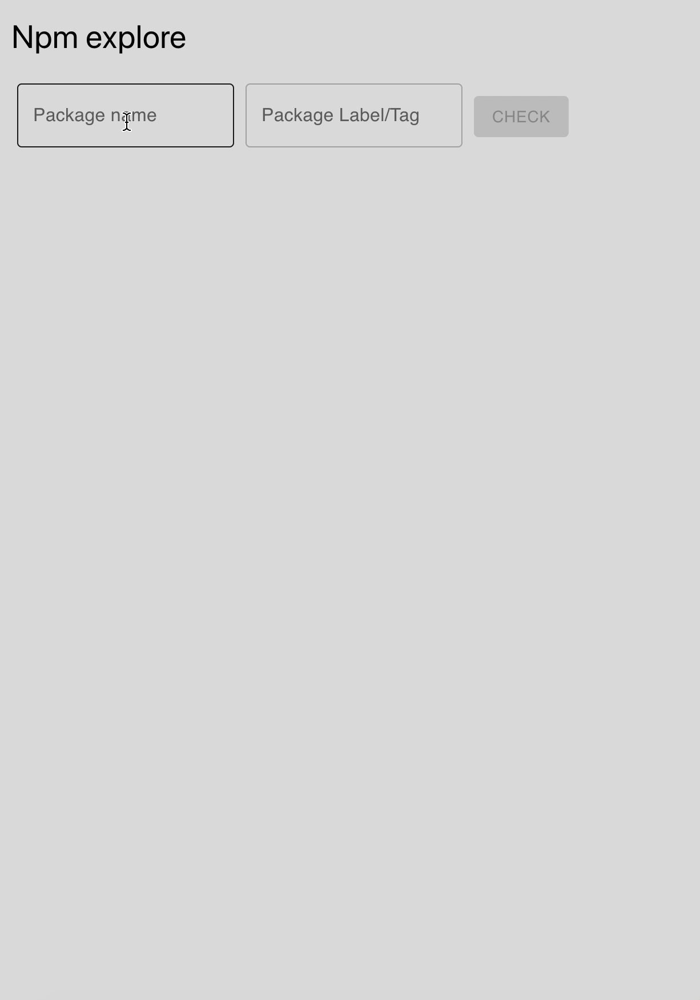

# Npm-explore



this is a react app to explore npm packages dependency's

## app

to run the app - go to app folder and run

```
npm i
npm start
```

## server

to run the server - go to server folder and run

```
npm i
node server
```
